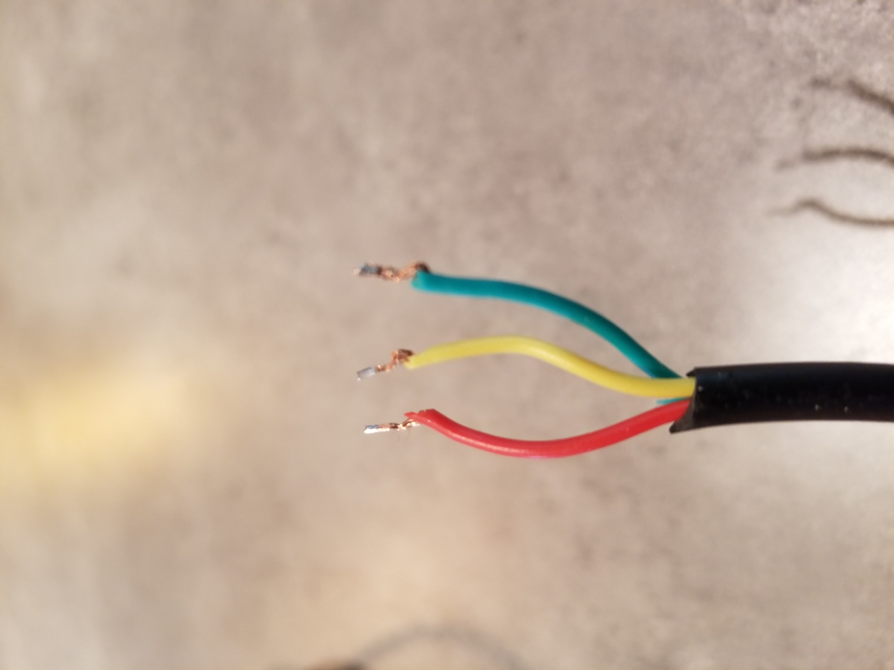
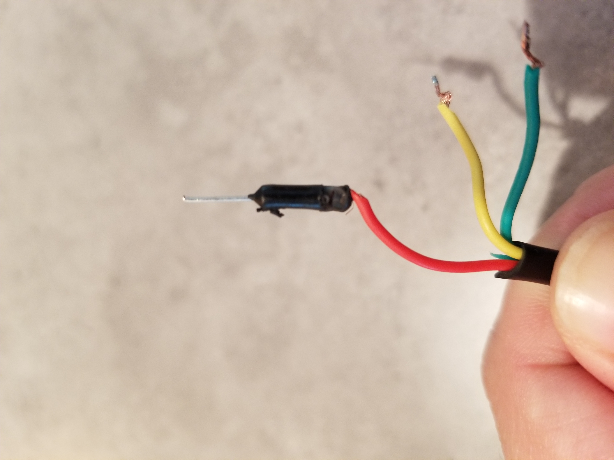
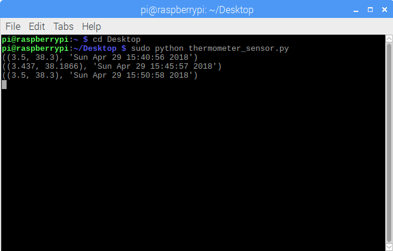

# Raspberry Pi Temperature Sensor

### Why I Chose a Temperature Sensor
I was searching for a Raspberry Pi related project to do because I had wanted to get a Raspberry Pi for a while now and this was a 
good excuse to buy one. When I was searching for a project to do, most of them were either really expensive because they involved Amazon Cloud services to use. These require subscriptions. Other projects involved hardware that would be either too expensive, or too complex to create in a short amount of time. The temperature sensor is a project that is not that expensive or difficult, and could be integrated into a much bigger project.
### What is it?
The temperature sensor that I used is a ds18B20. The ones I used are particularly waterproof. The temperature sensor communicates with the 
Raspberry Pi via an electrical circuit. Once the circuit is made, a python script must be used in order for the Raspberry Pi to read the data from the sensor.
### Materials Needed
* Raspberry Pi
* Raspberry Pi Necessities: Mouse/Keyboard, Monitor, Power Supply, SD Card with Operating System of choice (I used Raspbian)
* ds18B20 Digital Temperature Sensor
* Breadboard
* Breadboard Wires
* Raspberry Pi T-Cobbler
* *Optional*: Crimpers
* *Optional*: Breadboard Adapters
### My Experience
Once I got all the materials, I wanted to make sure that the Raspberry Pi worked first since it is the most important and expensive part. I attached the Raspberry Pi with the mouse/keyboard, monitor, and most importantly the sd card. You can find Raspberry Pi bundles with sd cards that have already been loaded with an operating system. Mine did not, so I used the easy set up tool to install the Raspbian OS found on the official Raspberry Pi website. The Raspberry Pi booted up as expected, so the next step was to set up the circuit itself.

The first step to set up the circuit was to attach the T-cobbler to the Pi and the breadboard. The next step was to put the breadboard wires in their respective slots. I had never set up an electrical circuit prior to this project, so I really didn't know where the wires would go. Luckily, the tutorial (link in the bottom) for the project had a video showing on how to set up the circuit. The next step was to make sure that the sensor worked.

The first step to make sure the sensor worked was to edit the boot config file with a text editior. I used vim. I had to put in, "dtoverlay=w1-gpio". From my understanding, this makes it so the 1 WIRE interface of the sensor can communicate with the GPIO on the Raspberry Pi. The next step was to load the modules. "sudo modprobe w1-gpio" and "sudo modprobe w1-therm" were the commands. Then I had to go to the directory "sys/bus/w1/devices." In that directory, anything that is plugged in and recognized via the 1 Wire interface will show up. 

#### My Problems
It was at this point that I thought that there was a major problem. In that directory, there should be something similar to, "28-000007602ffa" which would be the sensor. My directory was similar, but not close enough to the example. I don't have the exact numbers memorized, but it was something like 00-00000052ffa. I felt like it had too many zeroes, so something must have went wrong. Now usually wen you enter that directory, "xx-xxxffa" there would be a file called w1_slave. w1_slave is the sensor data. Unfortunately, mine did not have that file so I had to figure out what was wrong. I could rule out software isssues since the modules came up fine. My next thought was that I had a bad sensor. I bought a new sensor, plugged it in, and it still had the same issues. The end of the wires on both of the sensors were a little short, so I had to strip them a little bit. I had issues getting the sensor wires into the breadboard since they would bend so much. Luckily, the breadboard wires that I got had breadboard adapters on them, instead of having the wire soldered like other breadboard wires. I ripped off a few of the adapters off of the breadboard wires and used a crimper to attach them to the sensor wires. These adapters had long straight connectors so they stayed put. I went through and the w1_slave file came up, so it turns out that the problem was the ends of the sensors weren't communicating with the breadboard properly.

#### Coding
Once the w1_slave file was there, I did, "cat w1_slave" to see its contents. It contains two lines of text, the first line ends with YES, which means that the sensor is working. The second line ends with t=xxxxx which is the temperature data. Once I knew that it was working, it was time to work on the code. 

To summarize the code: I had to import os, glob, time, and ctime. I had to point out the modules that were being used (w1_gpio, w1_therm.) Then I had to point out the directory, device folder, and the device file. I had to define a raw temperature read, then make it so the temperature would be written as both degrees celcius and fahrenheit. Last thing to do was print out both of those values, with timestamps.

[The full python code can be found here.](../blob/master/thermometer_sensor.py)

### What I could have done different/ How it can be improved
There were a couple of things I could have done that would have probably lessen the cost, but taken more time. There were ways that I would've made the T-cobbler unnecessary. The other thing I saw was that other people have made their own temperature sensors. However, these temperature sensors were not waterproof. 

I like that the temperature sensors are waterproof becasue I believe that this small project could be part of a much larger project. There are many Raspberry Pi weather station projects that I think this sensor would be useful for. Anything where you might have to monitor water temperature (example: aquarium) would be useful. 

My idea was to make this temperature sensor, and set it up at my neighborhood lake where everyone goes. The neighborhood has their own board of directors with a Facebook page for the lake and everything. I thought it would be a cool thing to set up the sensor at the lake and send the temperature everyday at 2 or 3pm to a Facebook accessible database for everyone to see. However, this idea was flawed because the Pi needs a good power supply, there are no sockets near the water and there are no battery banks that would have the Pi powered for a long time.

### Conclusion
Overall I thought this was a fun little project, I learned a bit of how circuits work and I am hoping that I can find out a way to use the sensor with my lake idea. 

The pimylifeup tutorial I used was very straight forward and can be found [here.](https://pimylifeup.com/raspberry-pi-temperature-sensor/)
